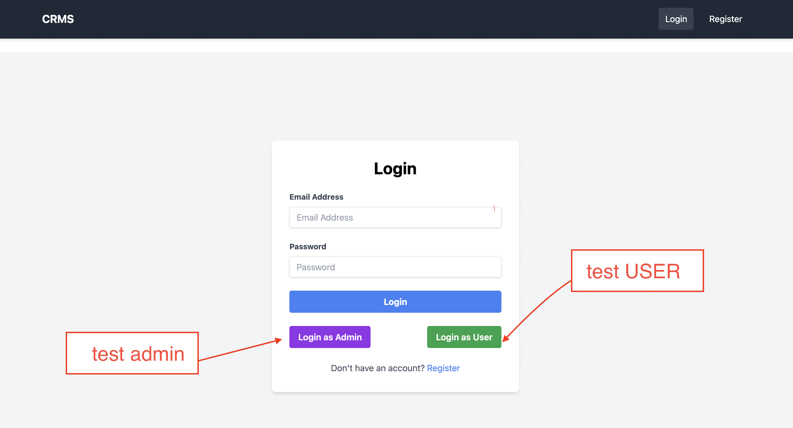
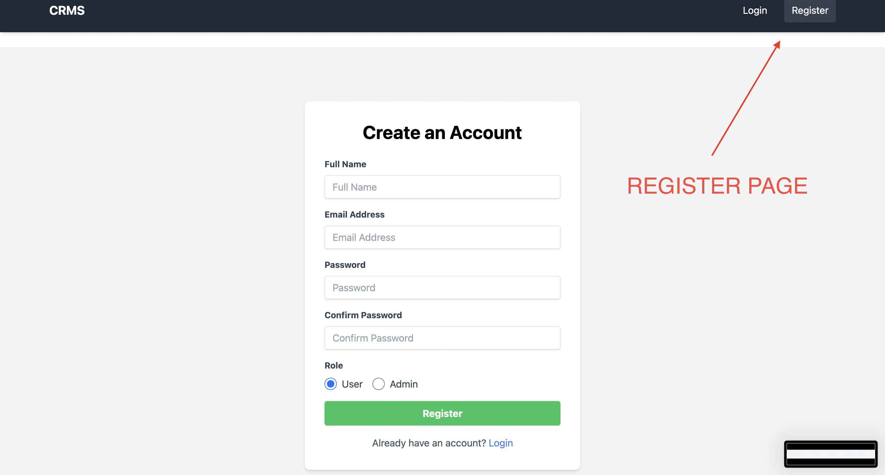
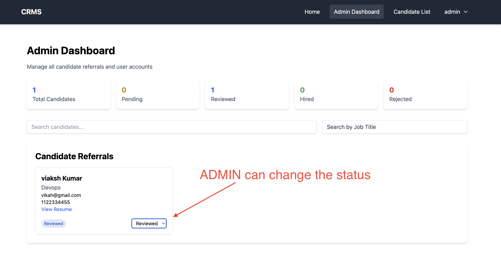
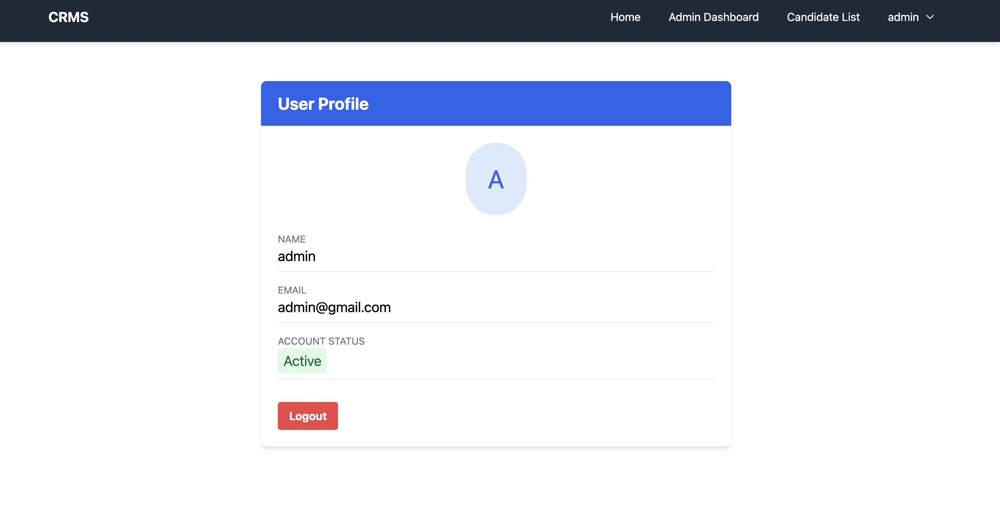
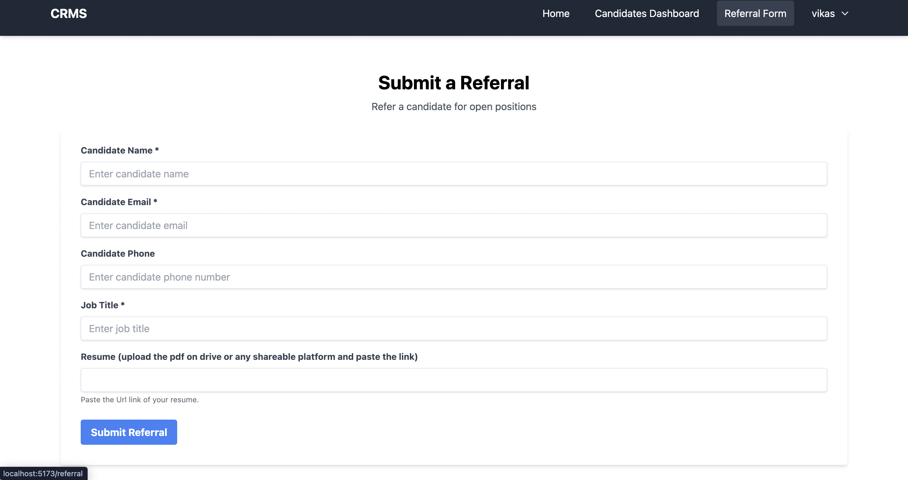

# Candidate Referral Management System (CRMS)

A comprehensive web application for managing employee referrals built with React and Vite. This system allows employees to submit candidate referrals and tracks these referrals through the hiring pipeline.


## Features

### User Authentication
- Secure login and registration system
- JWT-based authentication
- Role-based access control (Admin vs Regular User)
- Persistent sessions with token storage

### User Features
- Submit candidate referrals with resume attachments
- Track status of submitted referrals
- View and filter referrals by status, job title, and more
- Receive real-time notifications on status changes

### Admin Features
- Comprehensive dashboard with referral statistics
- View, manage, and update all referrals
- Change candidate status (Pending, Reviewed, Hired, Rejected)


### UI/UX
- Responsive design using Tailwind CSS
- Toast notifications for feedback
- User-friendly forms with validation
- Dashboard with filtering capabilities

## Tech Stack

- **Frontend**: React, React Router, Context API
- **Styling**: Tailwind CSS
- **HTTP Requests**: Axios
- **Notifications**: React-Toastify
- **Build Tool**: Vite







## Project Structure

```
src/
├── api/            # API service layer
├── components/     # Reusable UI components
├── contexts/       # React Context providers
├── Pages/          # Page components
│   ├── admin/      # Admin-specific pages
│   └── user/       # User-specific pages
```

## Installation and Setup

1. Clone the repository
   ```bash
   git clone https://github.com/yourusername/crms.git
   cd crms
   ```

2. Install dependencies
   ```bash
   npm install
   ```

3. Set up environment variables
   Create a `.env` file in the root directory:
   ```
   VITE_API_BASE_URL=http://localhost:8000
   ```

4. Start the development server
   ```bash
   npm run dev
   ```

## API Endpoints

The application connects to a backend API with the following endpoints:

### Authentication

| Endpoint | Method | Description | Request Body | Response |
|----------|--------|-------------|-------------|----------|
| `/api/user/signup` | POST | Register a new user | `{ name, email, password }` | `{ success: true, message }` |
| `/api/user/login` | POST | Login a user | `{ email, password }` | `{ user, token }` |

### User Referrals

| Endpoint | Method | Description | Request Body | Response |
|----------|--------|-------------|-------------|----------|
| `/api/user/referal-submit` | POST | Submit a new referral | Form data with candidate details and resume | `{ success: true, referral }` |
| `/api/user/my-referrals` | GET | Get all referrals made by the user | - | Array of referrals |

### Admin Endpoints

| Endpoint | Method | Description | Request Body | Response |
|----------|--------|-------------|-------------|----------|
| `/api/user/admin/referrals` | GET | Get all referrals (admin only) | - | Array of referrals |
| `/api/user/admin/referrals/:id/status` | PUT | Update referral status | `{ status }` | `{ success: true, updatedReferral }` |
| `/api/user/admin/referrals/:id` | DELETE | Delete a referral | - | `{ success: true, message }` |

## Authentication

All API requests (except login and register) require authentication using JWT tokens. The token is included in the Authorization header:

```
Authorization: Bearer [token]
```

## Usage

1. Login using your credentials or register if you don't have an account
2. Regular users can submit referrals using the Referral Form
3. View your submitted referrals in the Dashboard
4. Admin users have access to all referrals and can manage their status

## Demo Credentials

For quick testing, use the following credentials:

- **Admin Account**:
  - Email: admin@gmail.com
  - Password: admin@gmail.com

- **Regular User**:
  - Email: newUser@gmail.com
  - Password: qwerty@123


## Contributing

Contributions are welcome! Please feel free to submit a Pull Request.
